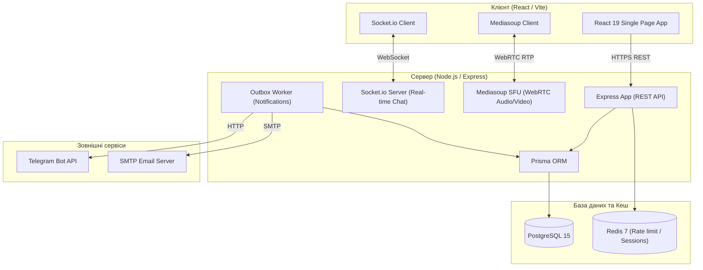

# myttrpg.me — Платформа для організації та проведення TTRPG-кампаній

<p align="center">
  
</p>

<p align="center">
  <strong>Сучасний вебпростір для поціновувачів настільних рольових ігор (TTRPG)</strong>
</p>

<p align="center">
  <a href="https://github.com/Kvarell/ttrpg-platform/actions/workflows/ci.yml">
    
  </a>
  <a href="https://sonarcloud.io/summary/new_code?id=Kvarell_ttrpg-platform">
    
  </a>
  <a href="https://sonarcloud.io/summary/new_code?id=Kvarell_ttrpg-platform">
    
  </a>
</p>

---

# Живий застосунок

Платформа є розгорнутою та доступною для використання в реальному часі:

**URL-адреса:** [https://myttrpg.me](https://myttrpg.me)

---

## Про проєкт

**myttrpg.me** – це інтегрована вебплатформа, що забезпечує повний життєвий цикл організації, координації та безпосереднього проведення настільних рольових ігор (TTRPG). Застосунок об'єднує організаційні інструменти (управління кампаніями, планування ігор, фінансовий баланс) з інтерактивними ігровими засобами (відеозв'язок, спільний ігровий чат, віртуальний стіл VTT).

Платформа покликана спростити комунікацію між Гейм-майстрами (GMs) та гравцями, автоматизувати процеси реєстрації на ігри та надати якісний зв'язок без залучення стороннього програмного забезпечення.

---

## Ключові можливості

### Управління кампаніями та сесіями

* **Кампанії:** Створення кампаній з детальним описом, встановленням ігрової системи (D&D, Pathfinder тощо), керуванням видимістю (публічна або за посиланням) та унікальними токенами доступу.
* **Сесії:** Планування конкретних ігор зі встановленням дати, часу, тривалості, вартості участі та ліміту гравців.
* **Запити на приєднання (Join Requests):** Зручний механізм подачі та модерації заявок на участь у кампаніях з відстеженням статусу.

### Інтерактивні медіадзвінки (WebRTC / Mediasoup SFU)

* Вбудована система аудіо- та відеоконференцій прямо в ігровій сесії.
* Базується на сучасній архітектурі **Mediasoup SFU (Selective Forwarding Unit)**, що гарантує низьку затримку та мінімальне навантаження на процесори користувачів завдяки розумній ретрансляції потоків замість повного перекодування.

### Чат-система в реальному часі

* Окремі інтерактивні чати для кожної кампанії та сесії.
* Підтримка текстового спілкування, системних повідомлень (наприклад, про приєднання нового гравця), а також можливість редагування та видалення повідомлень.

### Вбудована фінансова система (Wallet & Transactions)

* Власні віртуальні гаманці користувачів з підтримкою історії транзакцій.
* Проведення платних сесій з автоматичним розрахунком сервісного збору (Platform Fee) та безпечним утриманням коштів (hold) до підтвердження проведення гри.

### Багатоканальні сповіщення

* Транзакційна черга повідомлень на основі патерну **Outbox**.
* Можливість отримувати сповіщення трьома каналами:
  * Внутрішньосистемні сповіщення (In-App)
  * Telegram-бот (зручне підключення через Telegram Chat ID)
  * Повідомлення на електронну пошту
* Детальні налаштування профілю: тихі години (quiet hours), мутинг категорій та рівнів критичності сповіщень.

### Віртуальний ігровий стіл (VTT) та логування

* Візуалізація карт ігрових світів та робота з токенами.
* **Client-side Event Logger:** Система збору клієнтських логів безпеки та помилок для оперативного моніторингу та виправлення збоїв у роботі клієнта.

---

## Технологічний стек

Платформа побудована на основі сучасних та високопродуктивних технологій:

### Frontend

* **React 19** & **Vite 7** — швидкий рендеринг та сучасна збірка застосунку
* **React Router 7** — маршрутизація
* **TanStack Query** (React Query) — ефективне керування асинхронним станом та кешуванням
* **Zustand** — легковажне управління глобальним станом
* **Tailwind CSS** — адаптивна та гнучка стилізація
* **Mediasoup Client** — інтеграція з WebRTC SFU медіасервером

### Backend

* **Node.js 22** & **Express 5** — стабільна серверна платформа та API
* **Prisma ORM** — об'єктно-реляційне відображення для зручної роботи з базою даних
* **Socket.io (WebSockets)** — реалізація двостороннього обміну повідомленнями в чаті
* **Mediasoup SFU** — обробка та ретрансляція аудіо/відео потоків

### База даних та кеш

* **PostgreSQL 15** — збереження транзакційних та реляційних даних
* **Redis 7** — лімітування запитів (Rate Limiting), сесії та кешування

### Тестування та якість коду

* **Vitest & Testing Library** — модульне тестування інтерфейсу користувача
* **Playwright** — наскрізне (E2E) тестування критичних сценаріїв
* **Node Test Runner & c8** — тестування серверної логіки та аналіз покриття
* **SonarCloud** — безперервний аналіз якості коду та безпеки

---

## Архітектура системи

Наступна схема демонструє взаємодію основних компонентів системи:



---

<details>
<summary>🛠️ Інструкція для локального запуску та розробки</summary>

### Менеджмент залежностей

Проєкт використовує режим **npm workspaces** на рівні кореня:

* Усі залежності встановлюються з кореневої директорії.
* Використовується єдиний файл `package-lock.json`.
* **Важливо:** Не створюйте окремі lock-файли у директоріях `client/` або `server/`.

#### Встановлення залежностей

```bash
npm ci
```

### Локальний запуск

#### Запуск за допомогою Docker Compose (Рекомендовано)

Усі необхідні сервіси (Node, React, PostgreSQL, Redis) налаштовані для спільного запуску:

```bash
docker compose up --build
```

#### Запуск без Docker (необхідно мати локально встановлені Postgres та Redis)

Запустіть сервер та клієнт у різних терміналах:

```bash
# Запуск бекенду
npm run dev:server

# Запуск фронтенду
npm run dev:client
```

### Корисні скрипти розробника

```bash
# Збірка проєкту
npm run build
npm run build:client

# Статичний аналіз (Linter)
npm run lint
npm run lint:client
npm run lint:server

# Запуск тестів
npm run test
npm run test:client
npm run test:server
npm run test:e2e

# Аналіз покриття тестами (Coverage)
npm run test:coverage
```

</details>
